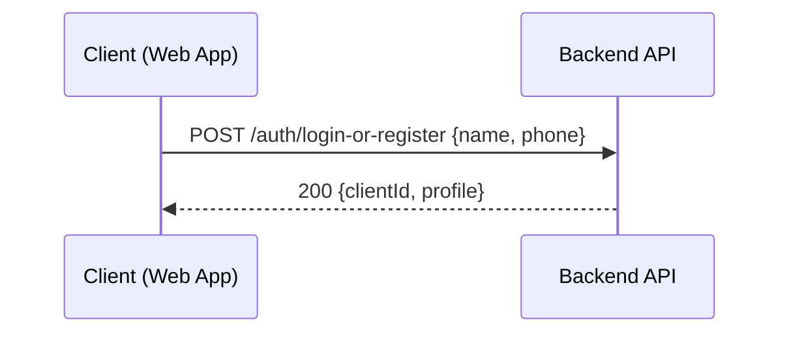
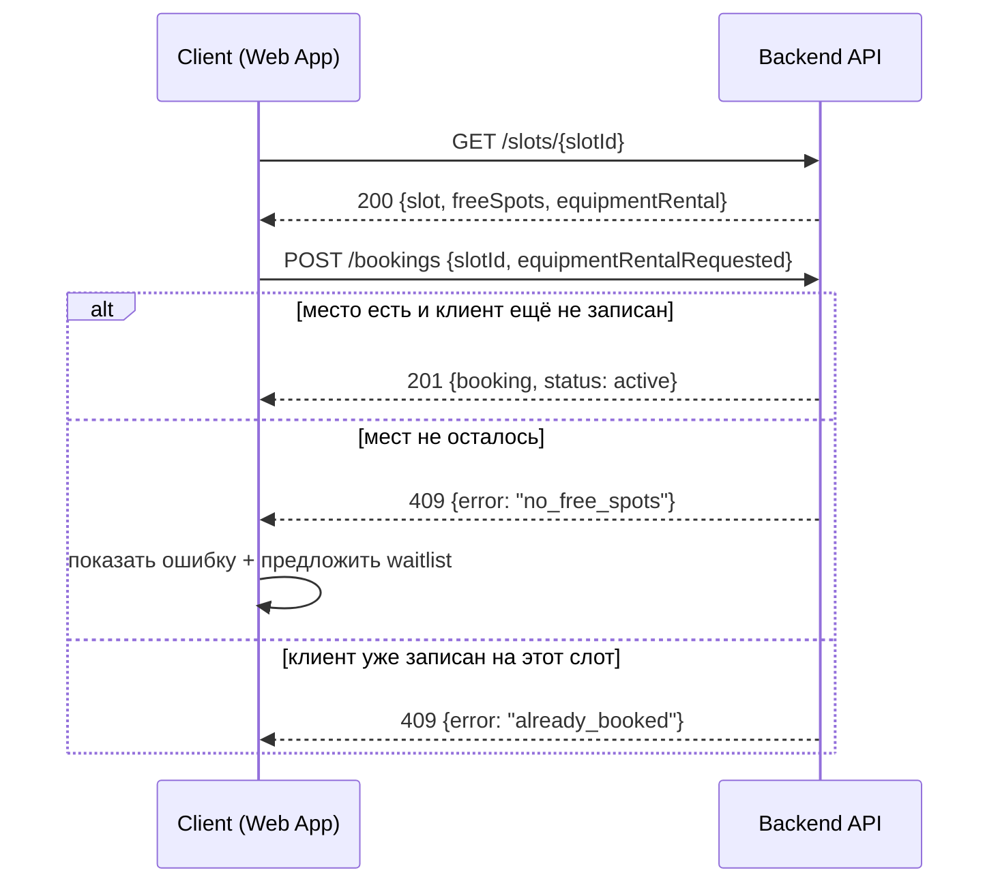
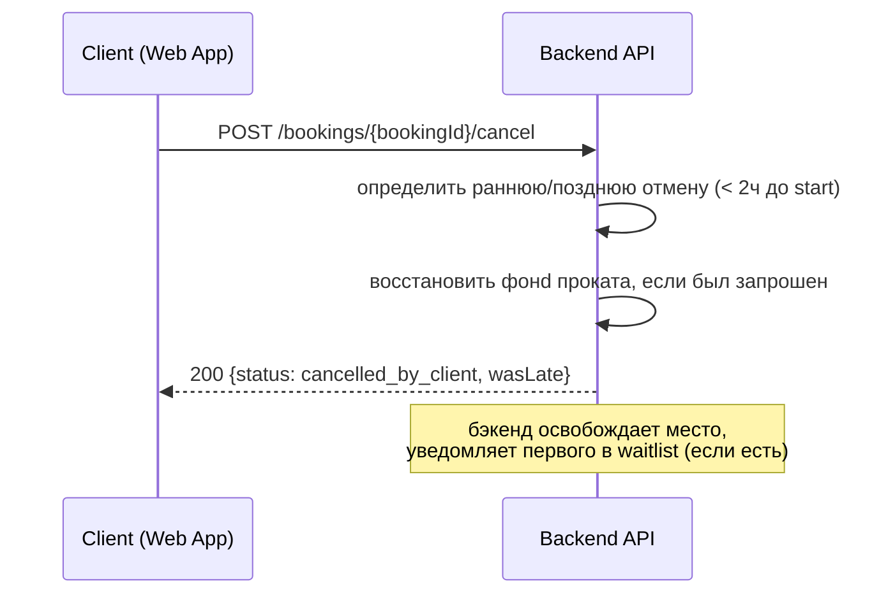

# api-sequence.md — Гончарная мастерская «Глина»

## 1. Вход (без SMS)

## 2. Create Booking

## 3. Cancel Booking

Важно: логика ранней/поздней отмены определяется **на бэкенде**, клиент не вычисляет время сам (ненадёжно и небезопасно — единый источник истины должен быть один).

