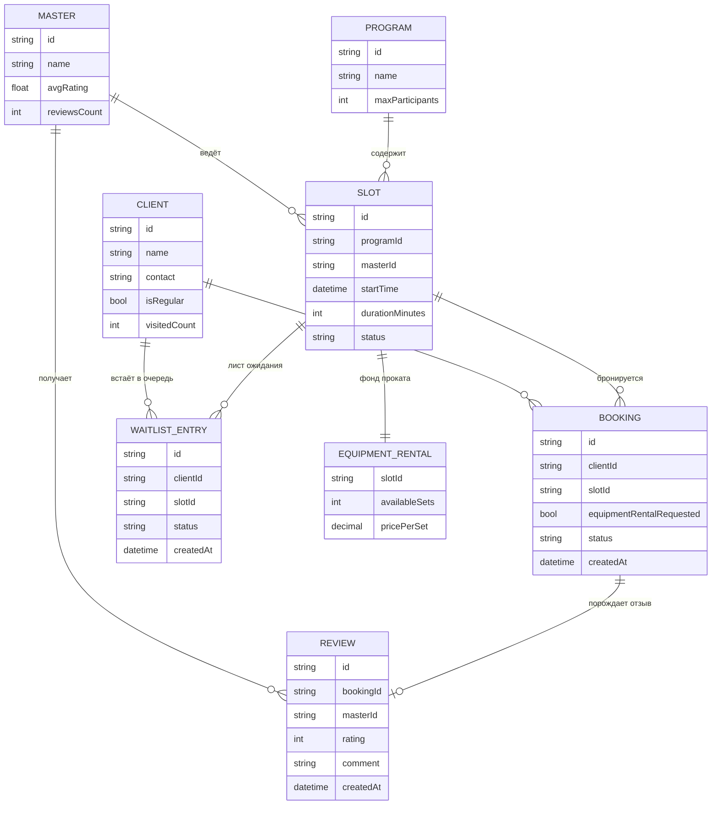

# data-model.md — Гончарная мастерская «Глина»

Каноническая схема — контракт API (см. openapi.yaml). Клиент читает Program/Slot/Master/EquipmentRental, создаёт/изменяет Booking/WaitlistEntry/Review.

## ER-диаграмма

## Важное архитектурное решение (принято по ходу разработки)

`Slot.freeSpots` **не хранится** как поле — это вычисляемая величина: `Program.maxParticipants − количество активных Booking на слот`. Это осознанный выбор после того, как хранимое поле создавало риск рассинхрона (см. `docs/bugs/bug-03-equipment-rental-leak.md` и обсуждение в диалоге о лимите программы). Аналогично `WaitlistEntry.position` не хранится, а всегда пересчитывается по текущему состоянию очереди.

## Примечания
- Slot.status: `active` | `cancelled_by_studio`
- Booking.status: `active` | `cancelled_by_client` | `cancelled_by_studio` | `completed`
- WaitlistEntry.status: `waiting` | `notified` | `converted` | `expired`
